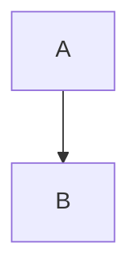

# `python`基础

## 1.`python`介绍

`python`的创始人为吉多·范罗苏姆（`Guido van Rossum`）。1989年的圣诞节期间，吉多·范罗苏姆为了在阿姆斯特丹打发时间，决心开发一个新的脚本解释程序，作为`ABC`语言的一种继承。 

* **目前Python主要应用领域：**
  * **云计算:** 云计算最火的语言， 典型应用`OpenStack`
  * **`WEB`开发**: 众多优秀的`WEB`框架，众多大型网站均为`Python`开发，`Youtube`, `Dropbox`, 豆瓣。。。， 典型`WEB`框架有`Django`
  * **科学运算、人工智能:** 典型库`NumPy`, `SciPy`, `Matplotlib`, `Enthought librarys`,`pandas`
  * **系统运维:** 运维人员必备语言
  * **金融：**量化交易，金融分析，在金融工程领域，`Python`不但在用，且用的最多，而且重要性逐年提高。原因：作为动态语言的`Python`，语言结构清晰简单，库丰富，成熟稳定，科学计算和统计分析都很牛逼，生产效率远远高于`c,c++,java`,尤其擅长策略回测
  * **图形`GUI`**: `PyQT`, `WxPython`,`TkInter`
* **Python在一些公司的应用：**
  * 谷歌：`Google App Engine` 、`code.google.com` 、`Google earth` 、`谷歌爬虫`、`Google广告等项目都在大量使用Python开发`
  * `CIA`: 美国中情局网站就是用`Python`开发的
  * `NASA`: 美国航天局(`NASA`)大量使用`Python`进行数据分析和运算
  * `YouTube`:世界上最大的视频网站`YouTube`就是用`Python`开发的
  * `Dropbox`:美国最大的在线云存储网站，全部用`Python`实现，每天网站处理10亿个文件的上传和下载
  * `Instagram`:美国最大的图片分享社交网站，每天超过3千万张照片被分享，全部用`python`开发
  * `Facebook`:大量的基础库均通过`Python`实现的
  * `Redhat`: 世界上最流行的`Linux`发行版本中的`yum`包管理工具就是用`python`开发的
  * 豆瓣: 公司几乎所有的业务均是通过`Python`开发的
  * 知乎: 国内最大的问答社区，通过`Python`开发(国外`Quora`)
  * 春雨医生：国内知名的在线医疗网站是用`Python`开发的
  * 除上面之外，还有搜狐、金山、腾讯、盛大、网易、百度、阿里、淘宝 、土豆、新浪、果壳等公司都在使用`Python`完成各种各样的任务。 

## `Python` 是一门什么样的语言？

* **编译和解释的区别是什么？**

**编译器**是把源程序的每一条语句都编译成机器语言,并保存成二进制文件,这样运行时计算机可以直接以机器语言来运行此程序,速度很快; 

而**解释器**则是只在执行程序时,才一条一条的解释成机器语言给计算机来执行,所以运行速度是不如编译后的程序运行的快的. 

这是因为计算机不能直接认识并执行我们写的语句,它只能认识机器语言(是二进制的形式)

